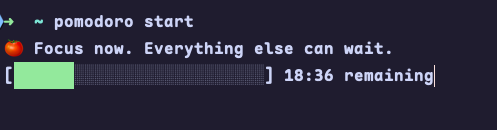
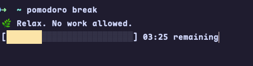

# CLI Pomodoro

A simple command-line Pomodoro timer built with TypeScript and Node.js.

<p align="center">
  
  
</p>

## Features

- Start a work session with `pomodoro start`
- Start a break session with `pomodoro break`
- Update work or break duration with `pomodoro set`
- View current configuration with `pomodoro config`
- Check package version with `pomodoro version`
- Built-in help output with `pomodoro help`

## Installation

```bash
npm install
npm run build
```

To use the CLI locally, run the compiled binary from the project root:

```bash
node ./dist/index.js <command>
```

To make the `pomodoro` command available globally, from the project root run:

```bash
npm install -g .
```

After that, you can use the CLI from any directory:

```bash
pomodoro start
pomodoro break
```

## Usage

```bash
pomodoro start
pomodoro break
pomodoro set work 50
pomodoro set break 10
pomodoro config
pomodoro version
pomodoro help
```

## Commands

- `pomodoro start` - Start a work session using the configured work duration.
- `pomodoro break` - Start a break session using the configured break duration.
- `pomodoro set work <minutes>` - Save a new work session duration.
- `pomodoro set break <minutes>` - Save a new break session duration.
- `pomodoro config` - Display the current work and break durations.
- `pomodoro version` - Print the application version from `package.json`.
- `pomodoro help` - Show available commands and usage.

## Configuration

Configuration is stored in the user home directory at `~/.pomodoro/config.json`.

Default values:

- `workDuration`: `25`
- `breakDuration`: `5`

Example config file:

```json
{
  "workDuration": 25,
  "breakDuration": 5
}
```

## Development

- `npm run build` - Compile TypeScript to `dist/`
- `npm run watch` - Rebuild on file changes
- `npm run dev` - Run the compiled app with Node watch mode

## Dependencies

- `chalk` - Terminal styling
- `typescript` - Development
- `@types/node` - Node.js type definitions

## Notes

- The CLI validates command names and reports invalid commands.
- Session settings must be whole numbers greater than zero.
- Configuration is persisted between runs in the user home directory.
